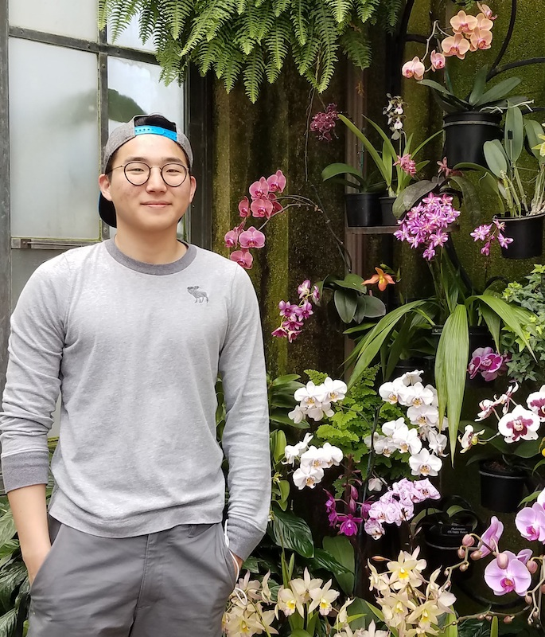
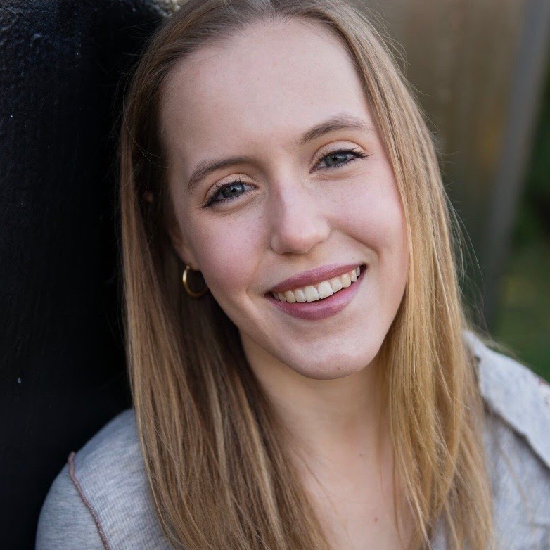
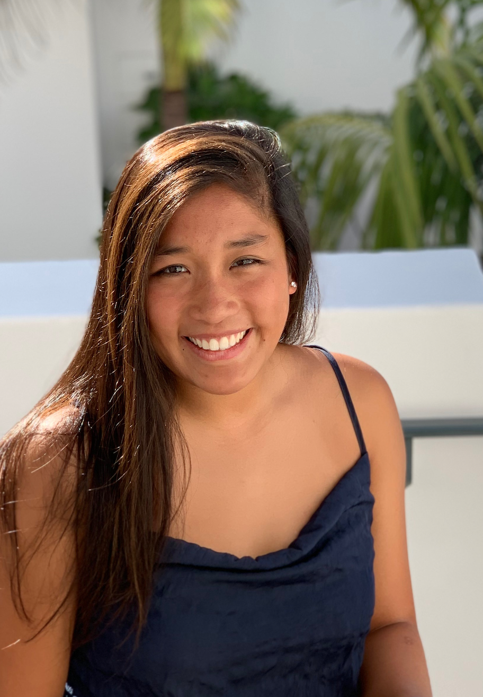
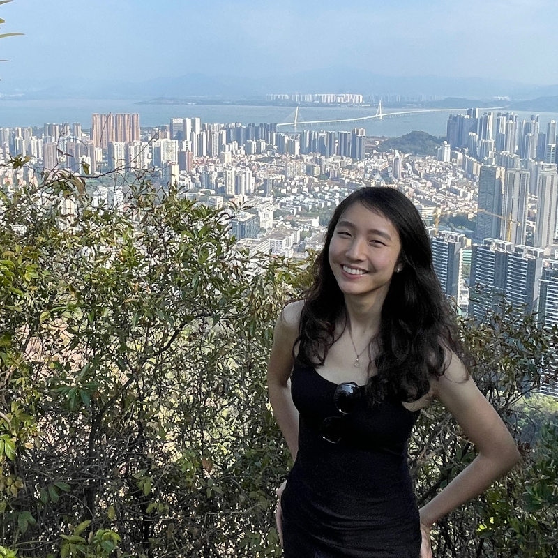
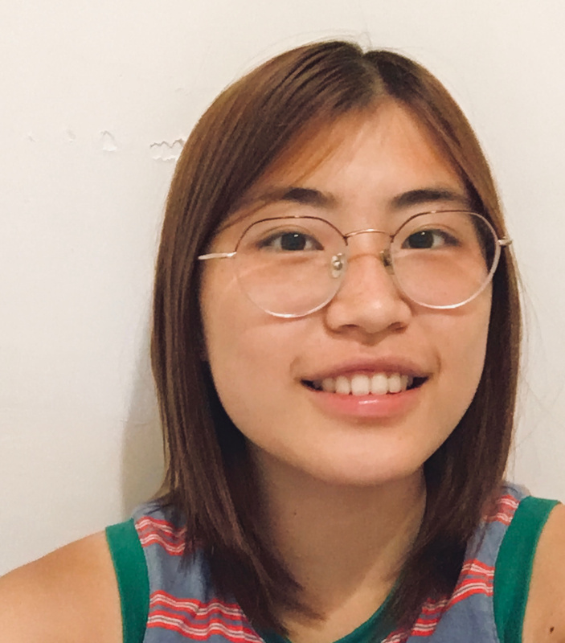

[\[Home\]](index.html) | [\[People\]](people.html) | [\[What We Do\]](research.html)

## Lab Members

### Lab director
[Benjamin Zinszer](#Benjamin-Zinszer)

### Senior thesis researchers
- [Jino Chough](#Jino-Chough)

### Student researchers
- [Rebecca Flack](#Rebecca-Flack)
- [Gaby Ma](#Gaby-Ma)
- [Selena She](#Selena-She)
- [Ping Wen](#Ping-Wen)
  
---

### Benjamin Zinszer
Benjamin Zinszer is a Visiting Assistant Professor in the Psychology Department at Swarthmore College and director of the CONE LAB. He earned his PhD in Psychology at Penn State University, studying the effects of cross-language interaction in Chinese-English bilinguals. His current work explores linguistic categories, neural semantic representations, and language development in both monolingual and bilingual learners. His personal website is <a href='http://benjaminz.com'>benjaminz.com</a>

### Jino Chough

Jino Chough is a neuroscience major, English literature minor at Swarthmore College, class of 2022.  He is interested in psychology and physics, and enjoys reading,
playing video games, and eating Korean fried chicken. 

### Rebecca Flack

Rebecca Flack is a Chinese Major, Global Studies Minor, and pre-med student in the class of 2023. After graduating she hopes to pursue a career in global medicine. In addition, Rebecca enjoys taking dance classes, giving campus tours to prospective students, running with her dogs, reading fantasy novels, and listening to podcasts. 

### Gaby Ma

Gaby Ma is currently a sophomore ('23) from California. She is a psychology major and part of the Swarthmore swim team. In her free time, she enjoys spending time with family and friends, hiking with her dog, and cooking.

### Selena She

Selena She is a prospective Math and Cognitive Science double major in the class of 2023. She's an international student from Shenzhen, China, and part of the Haverford cross country and track & field team. In her spare time, she likes hiking, filming, and riding roller coasters.

### Ping Wen

Wendy (Ping Wen) is an intended Cognitive Science and Math double major at Haverford College ('23). She lived in Beijing the longest, but she enjoys traveling and has resided in many areas around the globe. Moreover, she is in love with progressive rock, dogs and wolves, colors and harmonies, and learning about people's value systems, cognitive styles, and personalities.

---
