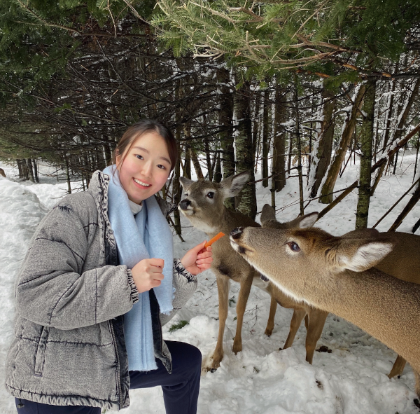
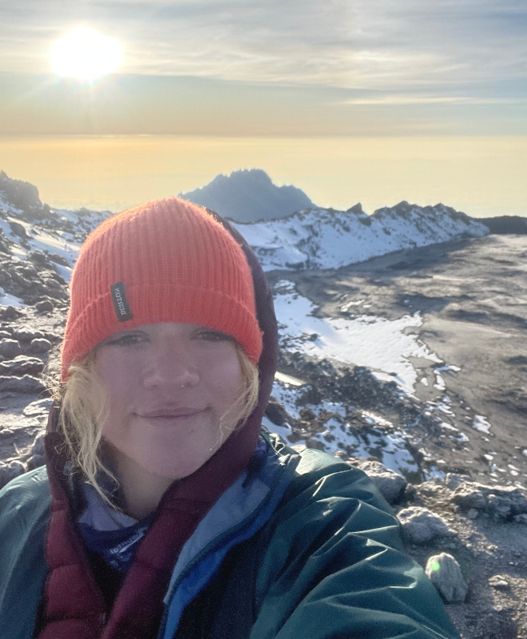
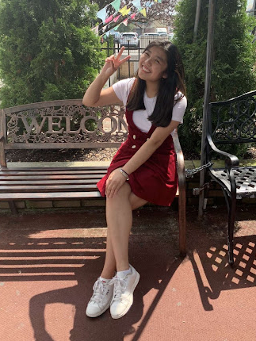
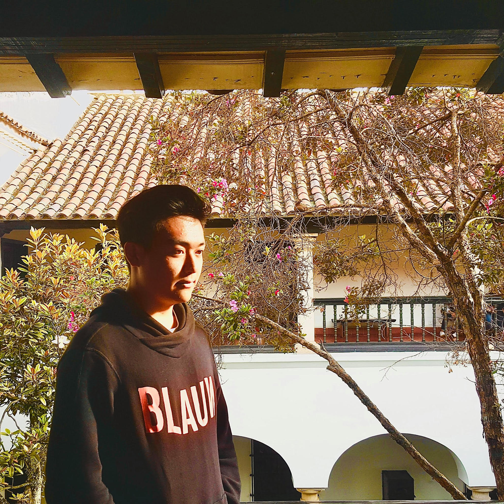

[\[Home\]](index.html) | [\[People\]](people.html) | [\[What We Do\]](research.html)

## Lab Members

### Lab director
[Benjamin Zinszer](#benjamin-zinszer) 
Visiting Assistant Professor in Psychology 
Swarthmore College

### Senior thesis researchers
[Anna&nbsp;Miller](#anna-miller)&nbsp;| 
[Mai&nbsp;Miura](#mai-miura) 

### Student researchers
[Sumin&nbsp;Byun](#sumin-byun)&nbsp;| 
[Madeleine&nbsp;Wang](#madeleine-wang)&nbsp;|
[Vic&nbsp;Wen](#vic-wen)

### Lab Alumni
[David&nbsp;Akinsooto](#david-akinsooto)&nbsp;| 
[Ricky&nbsp;WonJoon&nbsp;Choi](#ricky-wonjoon-choi)&nbsp;| 
[Jino&nbsp;Chough](#jino-chough)&nbsp;| 
[Jonah&nbsp;Covitz](#jonah-covitz)&nbsp;| 
[Fen&nbsp;Duarte](#fen-duarte)&nbsp;| 
[Rebecca&nbsp;Flack](#rebecca-flack)&nbsp;| 
[Kate&nbsp;Hart](#kate-hart)&nbsp;| 
[Gaby&nbsp;Ma](#gaby-ma)&nbsp;| 
[Selena&nbsp;She](#selena-she)&nbsp;| 
[Elizabeth&nbsp;Rosenthal](#elizabeth-rosenthal)&nbsp;| 
[Ping&nbsp;Wen](#ping-wen)&nbsp;| 
[Christopher&nbsp;Haochen&nbsp;Zhao](#christopher-haochen-zhao)

### Collaborating labs
[Bayet Lab @ American Univ.](https://www.bayetlab.com/)&nbsp;| 
[BOLD Lab @ Univ. Toronto](https://www.oise.utoronto.ca/boldlab/)&nbsp;| 
[Emberson Lab @ Univ. British Columbia](https://embersonlab.com)&nbsp;| 
[ERP Lab @ Swarthmore](https://www.swarthmore.edu/erp-lab)&nbsp;| 
[LLAMB Lab @ Haskins Laboratories](https://haskinslabs.org/research-centers/language-learning-and-multisensory-brain-llamb-lab)&nbsp;| 
[Llanos Lab @ UT-Austin](http://www.fernandollanos.net/)&nbsp;| 
State Key Laboratory for Cognitive Neuroscience and Learning @ Beijing Normal Univ.&nbsp;| 
[Q&nbsp;Lab @ Northeastern Univ.](https://qlab.sites.northeastern.edu)

---

---

### David Akinsooto

David Akinsooto is a Neuroscience and Economics double major in the Class of 2023 from Pittstown, New Jersey. He is a Premed student on the Swarthmore Mens lacrosse team. David loves to read in his free time, relax with friends and family, and exercising.

### Sumin Byun

Sumin is a Neuroscience and Statistics double major (class of 2025) from South Korea. After graduating, she hopes to pursue a graduate degree in Neuroscience/Statistics. Sumin loves to dance (choreography and ballet) and likes to read in her free time.

### Ricky WonJoon Choi

Ricky Choi (he/him) is a Psychology and Political Science double major in the class of 2023. He is interested in causal reasoning, language acquisition, and the application of computational models to simulate and better understand those topics. After graduating, Ricky hopes to pursue a graduate degree in developmental psychology and continue investigating causal and language development. In his free time, he enjoys cooking and lounging with his two cats, Kyky and Kenma.

### Jino Chough

Jino Chough is a neuroscience major, English literature minor at Swarthmore College, class of 2022.  He is interested in psychology and physics, and enjoys reading,
playing video games, and eating Korean fried chicken. 

### Jonah Covitz

Jonah Covitz is a Psychology and Economics double major in the class of 2022.  He is interested in decision science and how to apply cognitive neuroscience of language approaches to this field.  Jonah is a long jumper on the men's track and field team and plays saxophone in the school jazz ensemble.

### Fen Duarte

Fen Duarte is a Psychology major in the class of 2023, interested in statistical learning and language acquisition. Fen is a foilist on the Swarthmore Club Fencing Team, an active member of Swarthmore's Psi Phi (Not a Frat) club, and enjoyer of LARP. Fen enjoys board games, hiking, musical theater, and creative writing.

### Rebecca Flack

Rebecca Flack is a Chinese Major, Global Studies Minor, and pre-med student in the class of 2023. After graduating she hopes to pursue a career in global medicine. In addition, Rebecca enjoys taking dance classes, giving campus tours to prospective students, running with her dogs, reading fantasy novels, and listening to podcasts. 

### Kate Hart

 Kate Hart is a Psychology major with a Cognitive Science minor in the class of 2023 from Pittsburgh, PA. She is specifically interested in psychopathology. Kate is also a part of the Swarthmore Softball team. In her free time, she enjoys spending time with friends, family, and her cat.

### Gaby Ma

Gaby Ma is currently a sophomore ('23) from California. She is a psychology major and part of the Swarthmore swim team. In her free time, she enjoys spending time with family and friends, hiking with her dog, and cooking.

### Anna Miller

Anna Miller (she/her) is a Neuroscience and Global Health (Global Studies) double major in the class of 2024 from Seattle, Washington. She is interested in international health, particularly in how malnutrition affects cognitive function and development, as well as how health decisions are made. Anna is on the Swarthmore women's tennis team and enjoys painting, traveling and mountain climbing. 

### Mai Miura

Mai Miura is a December 2023 finisher majoring in Psychology and minoring in Gender and Sexuality Studies. She is from Tokyo, Japan and is interested in bilingual language processing. In her free time, Mai enjoys listening to music and playing volleyball.

### Elizabeth Rosenthal

Elizabeth Rosenthal (’23) is a Psychology and Biology double major from New York City. She is especially interested in pediatric neuropsychology. In her free time, she enjoys reading mystery novels, baking, and playing violin. 

### Selena She

Selena She is a prospective Math and Cognitive Science double major in the class of 2023. She's an international student from Shenzhen, China, and part of the Haverford cross country and track & field team. In her spare time, she likes hiking, filming, and riding roller coasters.

### Madeleine Wang

Madeleine Wang is a prospective Neuroscience and Statistics major in the class of 2026. Madeleine is from Long Island, New York, but has also lived in Ithaca, New York, Richmond, Virginia, and Taipei, Taiwan. At Swarthmore, she enjoys dancing with Rhythm N’ Motion, playing in various chamber ensembles and orchestras, and exploring Philadelphia’s coffee shops.

### Vic Wen

Vic Wen '26 (they/them) is a prospective psychology and linguistics double major. They’re interested in how language influences the mind and the brain, and after college they hope to pursue a graduate degree in psycholinguistics. In their free time, Vic enjoys learning languages, playing and writing music, and hanging out with their cats.

### Ping Wen

Wendy (Ping Wen) is an intended Cognitive Science and Math double major at Haverford College ('23). She lived in Beijing the longest, but she enjoys traveling and has resided in many areas around the globe. Moreover, she is in love with progressive rock, dogs and wolves, colors and harmonies, and learning about people's value systems, cognitive styles, and personalities.

### Christopher Haochen Zhao

Christopher Haochen Zhao is a prospective Psychology and Economics major sophomore at Swarthmore College. Originally from Beijing, China, he now mostly lives in Boston, MA. He is interested in discovering the psychological aspect of language processing. He is also a member of Swarthmore's mock trial team. In his free time, Chris enjoys studying Spanish, discovering good music, and playing soccer and hockey with friends.

### Benjamin Zinszer
Benjamin Zinszer is a Visiting Assistant Professor in the Psychology Department at Swarthmore College and director of the CONE LAB. He earned his PhD in Psychology at Penn State University, studying the effects of cross-language interaction in Chinese-English bilinguals. His current work explores linguistic categories, neural semantic representations, and language development in both monolingual and bilingual learners. His personal website is <a href='http://benjaminz.com'>benjaminz.com</a>

---
