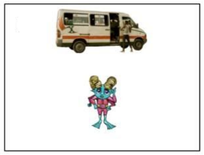

[\[Home\]](index.html) | [\[People\]](people.html) | [\[What We Do\]](research.html)

## Participating in Research

If you're interested in participating in future studies, please fill out [a short background form](https://forms.gle/xZ319cWiwZgzrk2D7) so we can contact you when a related study opens. 

Studies in our lab are reviewed by [Swarthmore College Institutional Review Board](https://www.swarthmore.edu/institutional-review-board) to protect the rights, welfare, and privacy of individuals participating as subjects in research.

---

## Current and Recent Projects

### How do words shape our judgments about objects?

Have you ever noticed that certain objects have many different names? And there is usually one name that just seems more fitting for that object? In this study, we are looking into this phenomenon to better understand how object-categorization varies within and between languages. We ask participants to name objects and rate how well they fit in different categories. We have found that these ratings depend on how people name the objects, suggesting that having a label like "cup" or "chair" for an object shapes our judgements about the object itself.

**Recent presentations:** [Gaby Ma's poster at Sigma Xi](ma_sigmaxi_2021.pdf)

### Do computational models of words accurately describe bilingual object categorization?

Can word-embedding models that learn by processing millions or billions of websites and articles predict how humans perceive the connection between two words? We created many pairs of words (ex. table vs. chair, bag vs. boot) and asked our monolingual & bilingual participants to rate how similar they are. Then, we compared AI-generated ratings to our human data. We found that even though English monolingual and Chinese-English bilinguals correlate differently with our model, these algorithms still may not capture the more nuanced differences between our two groups.

**Recent presentations:** [Selena She's poster at KINSC Symposium](she_kinsc_2021.pdf), [Wendy Wen's poster at KINSC Symposium](wen_kinsc_2021.pdf)

### Are basic sequence learning abilities related to success in language learning?
  

Jino's summary

**Recent presentations:** [Jino Chough's poster at Sigma Xi](chough_sigmaxi_2021.pdf)

**Recent publications:** [Zinszer et al., 2020, AfricArXiv](https://osf.io/preprints/africarxiv/q8k5w/)

---

#### Licensing, Copyright, Copyleft
This work is licensed under a <a rel="license" href="http://creativecommons.org/licenses/by-nc-sa/4.0/">Creative Commons Attribution-NonCommercial-ShareAlike 4.0 International License</a>.

