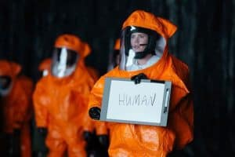

[\[Home\]](index.html) | [\[People\]](people.html) | [\[What We Do\]](research.html)

### What do we study in CONE LAB?

  In the CONE LAB we study how human brains learn language, represent linguistic information, and are shaped by our different learning experiences. 
  We're especially interested in the solutions that learners find when provided conflicting information about categories. A very common example of 
  this experience is bilingualism, where people learn not only two languages' worth of information, but they also manage conflicts in the ways that 
  these languages organize the world. Our work includes all kinds of language learners, from babies to adults, and many levels of proficiency. We use 
  behavioral, computational, and brain imaging methods (like EEG, fNIRS, and fMRI) to study the cognitive and neural systems that represent 
  linguistic knowledge in people who speak one, two, or many languages.

### Research Areas

**Linguistic Categories & Bilingualism** - 

Languages arise to support communities of language users, and therefore languages reflect the experiences and needs of people who use them... (Click to keep reading)
 To the extent that communities' ways of organizing information differ, we might expect their languages to do the same. Sapir expressed this view in extreme, writing, "The worlds in which different societies live are distinct worlds, not merely the same world with different labels attached" (1929, in _Language_). Since then, decades of language and psychology research has shown that not only languages differ, but people who use languages differ too: Even highly skilled bilinguals perform simple language tasks like object naming differently than monolinguals of the same language. These differences may go undetected in fluency (speed and ease of speech), but subtle variations can result in misunderstandings, like ordering a "white wine" and instead receiving a bottle of vodka (a typical translation error between English and Chinese), or demand extra effort and resources, a familiar experience to anyone who felt exhausted after attending a lecture in their second language. Our research aims to discover and understand the differences between how languges and language users represent information and learn the cognitive consequences of these language disagreements.

**Statistical Learning** - 

Statistical learning is a mechanism for finding patterns in the environment, such as the order in which certain events occur (like syllables in speech) or the links between sounds and images (like the names of objects)... (Click to keep reading)
 The statistical learning mechanism is available from infancy, and probably supports some of babies' first discoveries about language. However, statistical learning is also active throughout childhood and adulthood. We are interested in how this ability to find patterns helps children learn how to read, how differences in this ability contribute to different outcomes in literacy, and whether statistical learning experiments do a good job of representing the different ways children learn to read in different educational contexts. One of those contexts is bilingulism, where children or adults know two different languages (and thus, two different patterns). We explore how statistical learning mechanisms can be applied when two artificial languages provide different, competing patterns. These studies investigate how a simple learning mechanism like SL might contribute to the very complicated inferences that learners (infants, children, and adults) make as they navigate between languages.

### Collaboration
[**Team MCPA**](http://teammcpa.github.io/) - Multivariate pattern analysis of adult and infant fNIRS data

[**Allô Alphabet**](https://sites.udel.edu/boldlab/current-projects/) - Phone-based literacy intervention in rural Côte d'Ivoire

[**SPIN Scorcerer**](http://spin-scorcerer.github.io/) - Automated text processing tool for detailed scoring of speech-in-noise transcriptions

### Contact
Benjamin Zinszer (bzinszer@swarthmore.edu)

#### Licensing, Copyright, and Copyleft
Unless otherwise noted, software available on this page is provided under the [GNU General Public License v2.0](https://www.gnu.org/licenses/old-licenses/gpl-2.0.en.html). The GNU GPL is the most widely used free software license and has a strong copyleft requirement. When distributing derived works, the source code of the work must be made available under the same license. Redistribution of this code must also include (1) a copy of the enclosed license and copyright notice, (2) state what changes, if any, have been made to the code, (3) provide attribution to the authors of the code, in this case Benjamin Zinszer and the CONE LAB, and (4) remain under the same GNU GPL v2.0 license.
